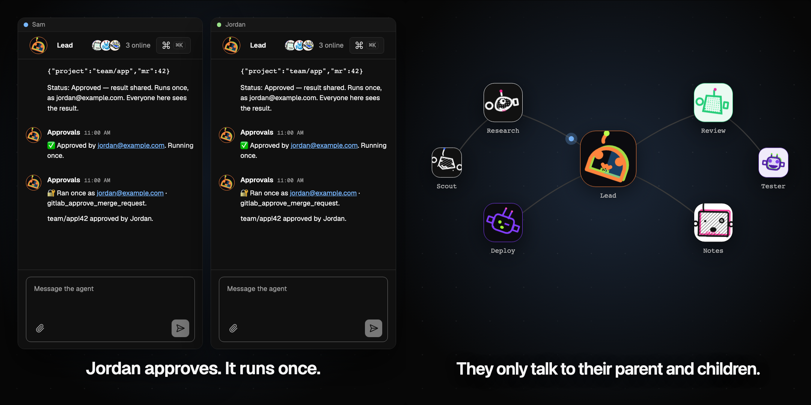
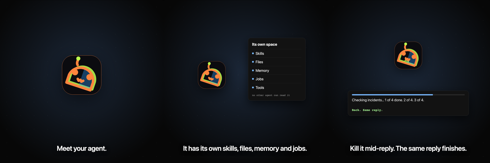

# Chat AX

A shared chat room where your team and a fleet of AI agents work together, on your own Cloudflare account.



[Watch the 44-second video](docs/images/chat-ax.mp4)

- **One agent, many people.** Everyone talks to the same agent and sees every reply stream in. When several people ask at once, you choose how the queue runs: first in first out, quick questions first, round robin, parallel, and 16 more.
- **Each agent has its own space.** Settings, tools, skills, files, state and scheduled jobs belong to that agent. It can edit them itself, with no one clicking anything.
- **Replies survive restarts.** Every turn is stored as it runs. Kill the runtime mid-reply and the same reply finishes after it comes back. Built on [pi-durable](https://www.npmjs.com/package/@earendil-works/pi-durable).
- **Your tools stay yours.** Connect your own MCP server (GitLab, Jira, anything). The agent uses your connector only on turns you send. If Sam asks it to use yours, nothing runs: you get a notification, and if you approve, that one action runs once, as you. Every step is written into the chat.
- **Agents are rooms too.** Give an agent helpers, and give them helpers. Each one is the same kind of room. Agents message their parent and children; anything sideways needs a one-time grant.
- **Push notifications** when someone needs you, with Approve and Deny on the notification itself.
- **Drive it from your own agent.** Everything in the app is also an MCP server at `/mcp`. From Pi, Claude Code or any MCP client you can create agents, message them, schedule jobs and watch the fleet without opening the UI.
- **Check the security yourself.** `npm run verify:security` runs a local MCP server with two accounts and tries to cross between them. Each attempt prints `HELD` or `BROKEN`, and the run writes receipts you can read. See [docs/security.md](docs/security.md).

It runs on the Workers free plan. No database to run and no API keys to paste; the default model is Workers AI on your account.



## Install

It takes about five minutes. You need:

- A Cloudflare account. The free plan works. [Sign up here](https://dash.cloudflare.com/sign-up).
- Node 20 or later. Check with `node --version`.

Then run these three commands:

```sh
git clone https://github.com/acoyfellow/chat-ax && cd chat-ax
npm install
npm run setup
```

`npm run setup` asks you two things:

1. **Sign in to Cloudflare.** A browser window opens. Approve it and come back.
2. **Who may use it.** Type emails, a whole domain, or both, for example `you@gmail.com,@acme.com`.

Then it deploys and prints your URL, like `https://chat-ax.<you>.workers.dev`. Open it, sign in with one of the emails you allowed, and you're in. Send that URL to your team.

Behind the scenes, setup:

- Deploys the Worker to your account.
- Puts it behind [Cloudflare Access](https://developers.cloudflare.com/cloudflare-one/policies/access/), so only the people you allowed get in. Access is free for up to 50 people, and guests sign in with a code sent to their email.
- Saves the Access details on the Worker. Until that's done, the Worker refuses everyone.

**To update or change who can sign in,** pull the latest code and run `npm run setup` again. It reuses what already exists.

**To skip the questions,** pass them in: `npm run setup -- --allow you@gmail.com --account <account-id>`.

### Why there's no "Deploy to Cloudflare" button

The button can deploy the code, but it can't set up Access. That would leave a public URL that anyone could use, so setup does both in one step instead.

### If something goes wrong

- **The browser sign-in didn't finish:** run `npx cf auth login`, then `npm run setup` again.
- **`wrangler deploy` asked you to sign in:** run `npx wrangler login`, then `npm run setup` again.
- **You have more than one Cloudflare account:** setup asks which one. Or pass `--account <account-id>`.
- **The URL says you're not allowed in:** sign in with an email you gave setup, or run setup again and add yours.

> `workers_dev` is `false` in `wrangler.jsonc` on purpose. A plain `wrangler deploy` will never publish an unprotected URL. Setup turns it on only for its own deploy, then puts it behind Access.

## Try it locally

```sh
npm run dev:test
```

Open <http://127.0.0.1:8787>. You're signed in as a local test user, and a built-in test model replies, so you don't need a Cloudflare account. To use real models locally, run `npx wrangler login` and then `npm run dev`.

## What it costs

On the Workers free plan, Chat AX costs nothing. The limits that matter:

- **Models:** Workers AI includes 10,000 Neurons a day for free, enough for casual team use with the default GLM 5.3 model. Beyond that you need the Workers Paid plan ($5 a month plus usage).
- **Durable Objects and R2** (conversation, agents, and files) fit easily in their free allowances for a team.
- **GPT-5.6 and Claude Opus 5.5** are in the model picker. They go through AI Gateway and are billed to your Cloudflare account, which needs [AI Gateway credits](https://developers.cloudflare.com/ai-gateway/features/unified-billing/) loaded first.

To watch or cap GPT and Claude spending, open **AI → AI Gateway → default** in the dashboard. Scheduled agent jobs are listed under each agent's **Jobs** tab, where you can pause or delete them.

## Configure

Every setting is optional. Set them in `wrangler.jsonc`, or as variables or secrets in the dashboard.

| Setting | What it does |
|---|---|
| `DEFAULT_MODEL` | The model new agents start with. Defaults to `@cf/zai-org/glm-5.3` on Workers AI, which every account can use. Options: `@cf/moonshotai/kimi-k3` (if your account has access), `gpt-5.6-luna`, `gpt-5.6-sol`, `gpt-5.6-terra`, `anthropic/claude-opus-5-5`. People can also switch models per agent in Settings. |
| `CF_ACCESS_ISS`, `CF_ACCESS_AUD` | Your Access team URL and application audience. `npm run setup` saves them as secrets. Without both, the Worker serves only a setup notice. |
| `MASTER_KEY` | Encrypts personal connector tokens. Generated automatically if unset. Set your own (`openssl rand -base64 32`) if you might ever move the data. |
| `ADMIN_EMAILS` | Comma-separated emails that may read diagnostic receipts. |
| `MCP_SERVER_URL` | A remote MCP server each person can connect with their own account, for example your company's tool portal. It must be reachable from the internet and support OAuth with dynamic client registration. For servers without discovery, also set `MCP_OAUTH_AUTHORIZE_URL`, `MCP_OAUTH_TOKEN_URL`, and `MCP_OAUTH_REGISTRATION_URL`. |
| `MCP_CONNECTOR_NAME` | The name people see in Settings. Defaults to the server's hostname. |
| `AI_GATEWAY_ID` | An AI Gateway to route Workers AI traffic through for logs and limits. Unset, Workers AI is called directly. GPT and Claude always use a gateway, `default` unless this is set. |
| `VAPID_SUBJECT`, `VAPID_APPLICATION_SERVER`, `VAPID_PRIVATE_KEY` | Turn on browser push notifications. Generate a key pair with `npx web-push generate-vapid-keys`. |

To use a custom domain, add it under the Worker's **Settings → Domains & Routes**, add the domain to the same Access application, and turn `workers_dev` off.

## Bring your own MCP

Chat AX ships with no tools of its own. You point it at one MCP server, usually the one your company already runs in front of GitLab, Jira, a wiki, or a deploy system, and each person connects it with their own login.

```jsonc
// wrangler.jsonc → "vars"
"MCP_SERVER_URL": "https://tools.example.com/mcp",
"MCP_CONNECTOR_NAME": "Company tools"
```

Deploy, then each person opens **Settings → Connectors → Connect** and signs in. That is the whole setup.

What the server needs:

- Reachable from the internet over HTTPS, speaking MCP over streamable HTTP.
- OAuth 2.1 with dynamic client registration. If it does not publish discovery metadata, also set `MCP_OAUTH_AUTHORIZE_URL`, `MCP_OAUTH_TOKEN_URL`, and `MCP_OAUTH_REGISTRATION_URL`.

What you get, without writing any permission code:

- **Your access stays yours.** Tokens are encrypted per person in the connector vault. An agent turn can use your connector only when you sent it. Asking in chat, "use Jordan's GitLab", does nothing.
- **Asking crosses people, not credentials.** When Sam needs something only Jordan can do, Sam's agent calls `request_person`. Jordan gets a request card with Accept and Decline. If Jordan accepts, the work runs with Jordan's own connector, in Jordan's name. Sam never holds Jordan's token.
- **Writes ask first.** Tool calls that change things show an approval card to the connector owner before they run, and every call leaves a receipt.

### Keep your server private

The address of your MCP server is deployment configuration, not code. Keep it out of your fork:

```text
chat-ax            public engine, no company details
chat-ax-private    your repo: ENGINE_SHA, wrangler.production.jsonc with MCP_SERVER_URL, deploy script
```

The private repo pins an exact engine commit, overlays its config, and deploys. Upgrading the engine is a one-line change to `ENGINE_SHA`.

### See the hand-off without a second person

`npm run demo:review` opens two browser windows on local dev, one signed in as Sam and one as Jordan. Sam asks his agent to get a merge request reviewed by Jordan, the request card appears only on Jordan's side, Jordan accepts, and Sam watches it change to Reviewing. Add `-- --decline` to show the refusal path. It refuses to run against anything but localhost.

## Use it from your own agent

Chat AX is an MCP server at `https://<your-host>/mcp`, behind the same Access sign-in. Point any MCP client at it and you act as yourself:

```text
list_agents · create_agent · send_agent_message · delegate_to_agent
agent_job_create · agent_job_pause · agent_skill_create · agent_file_upload
chat_send_message · request_person · grant_agent_communication · …37 tools
```

The same rules apply as in the UI: your connector only runs on your turns, other people's connectors need their approval, and agents only message within their tree.

## How it works

```text
Browser → Cloudflare Access → Worker ─┬─ Room Durable Object     shared transcript, fleet map, jobs, notifications
                                      ├─ Agent Durable Objects   one per agent: memory, files, skills, durable turns
                                      ├─ Connector vault         each person's encrypted MCP tokens
                                      ├─ R2                      file attachments
                                      └─ Workers AI + AI Gateway models
```

- Cloudflare Access proves who each person is. Every message, tool call, and approval is tied to that verified identity, never to names typed into the chat.
- Each agent is its own Durable Object with its own SQLite storage. Agents talk to each other only along the fleet tree unless you allow more.
- Agent turns run on [pi-durable](https://www.npmjs.com/package/@earendil-works/pi-durable). Text, tool calls, and results are saved as they happen, and a tool that was interrupted is reported as interrupted instead of being silently run twice.
- Personal MCP tokens are encrypted per person and never reach the model or the transcript.
- There is one room per deployment. Deploy again under another name for a separate group.
- Chat AX is also an MCP server at `/mcp`, so other agents, including the one in your terminal, can read the room, run fleet agents, and send messages with your identity.

Read [docs/security.md](docs/security.md) for exactly what is enforced and which test proves it, and [docs/person-requests.md](docs/person-requests.md) for asking teammates for work. [features/chat-ax.feature](features/chat-ax.feature) describes the fleet's behaviour scenario by scenario.

## Develop

You need Node 20 or later. Everything else installs with `npm install`.

```sh
npm test            # unit tests
npm run dev:test    # local server with the test model on :8787
npm run test:e2e    # browser test of the fleet map against that server
npm run typecheck
npm run verify:security   # security checks, with receipts in receipts/
npm run setup       # build and deploy behind Access
```

`/video` on a local server plays the showcase above. The approval scene is the real chat component fed scripted data. `?t=26.6` freezes it at a moment.

The code is in `src/`. Start with `worker.ts` (routes), `room.ts` (the shared room), and `agent-do.ts` (one agent). The UI is Svelte in `src/ui/`.

## Remove it

Delete the Worker in **Workers & Pages**, then the `chat-ax-files` bucket in **R2**, and the Access application in **Zero Trust → Access → Applications**. Conversations and agents are stored in the Worker's Durable Objects and are deleted with it.

## License

MIT
