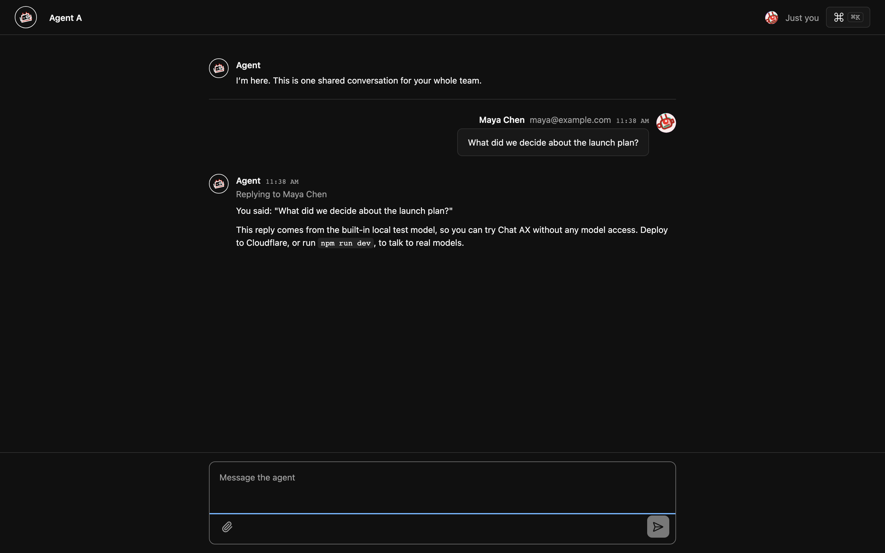
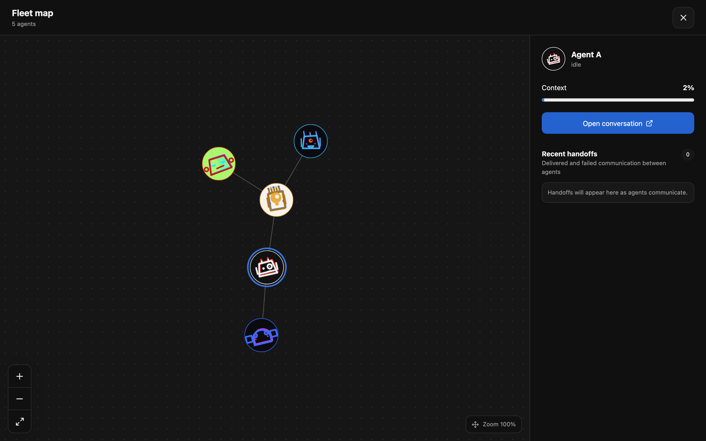

# Chat AX

**One shared chat room for your whole team, with a fleet of AI agents that never forget.** It runs entirely on your own Cloudflare account.



- **One conversation, everyone in it.** Your team talks to the same agent in the same room, and everyone sees every reply as it streams in.
- **A fleet, not a bot.** Give the main agent helpers, give them helpers, and watch them work on a live map. Each agent has its own memory, files, skills, and schedule.
- **Turns that survive crashes.** Every agent turn is stored as it runs, so a deploy or restart in the middle of a reply picks up where it left off. Built on [pi-durable](https://www.npmjs.com/package/@earendil-works/pi-durable).
- **Each person's tools stay theirs.** Connect an MCP server with your own account. The agent can use your tools only on turns you send. Nobody borrows anyone else's access by asking nicely.
- **Nothing to manage.** No database to run and no API keys to paste. It runs on the Workers free plan, and the default model is served by Workers AI on your account.



## Deploy

You need a Cloudflare account (the free plan works) and Node 20 or later.

```sh
git clone https://github.com/acoyfellow/chat-ax && cd chat-ax
npm install
npm run setup
```

Setup signs you in to Cloudflare, asks who may use the app (emails or `@your-domain.com`), and then:

1. Deploys the Worker to `chat-ax.<your-subdomain>.workers.dev`.
2. Puts that URL behind a [Cloudflare Access](https://developers.cloudflare.com/cloudflare-one/policies/access/) application that admits only those people. Access is free for up to 50 users, and guests sign in with a one-time code sent to their email.
3. Saves the application's issuer and audience on the Worker as secrets. The Worker serves nobody until they exist and accepts only tokens from that application.

Share the URL. Everyone who can sign in joins the same room. Run `npm run setup` again to deploy updates or change who may sign in. It reuses what already exists. Pass `--allow`, `--account` and `--name` to skip the questions.

> **Why `workers_dev` is `false` in `wrangler.jsonc`:** so a plain `wrangler deploy` never publishes an unprotected public URL. Setup turns `workers.dev` on only for its own deploy, then puts it behind Access.

## Try it locally

```sh
npm run dev:test
```

Open <http://127.0.0.1:8787>. You're signed in as a local test user, and a built-in test model replies, so you don't need a Cloudflare account. To use real models locally, run `npx wrangler login` and then `npm run dev`.

## What it costs

On the Workers free plan, Chat AX costs nothing. The limits that matter:

- **Models:** Workers AI includes 10,000 Neurons a day for free, enough for casual team use with the default GLM 5.3 model. Beyond that you need the Workers Paid plan ($5 a month plus usage).
- **Durable Objects and R2** (conversation, agents, and files) fit easily in their free allowances for a team.
- **GPT-5.6 and Claude Opus 5.5** are in the model picker. They go through AI Gateway and are billed to your Cloudflare account, which needs [AI Gateway credits](https://developers.cloudflare.com/ai-gateway/features/unified-billing/) loaded first.

To watch or cap GPT and Claude spending, open **AI → AI Gateway → default** in the dashboard. Scheduled agent jobs are listed under each agent's **Jobs** tab, where you can pause or delete them.

## Configure

Every setting is optional. Set them in `wrangler.jsonc`, or as variables or secrets in the dashboard.

| Setting | What it does |
|---|---|
| `DEFAULT_MODEL` | The model new agents start with. Defaults to `@cf/zai-org/glm-5.3` on Workers AI, which every account can use. Options: `@cf/moonshotai/kimi-k3` (if your account has access), `gpt-5.6-luna`, `gpt-5.6-sol`, `gpt-5.6-terra`, `anthropic/claude-opus-5-5`. People can also switch models per agent in Settings. |
| `CF_ACCESS_ISS`, `CF_ACCESS_AUD` | Your Access team URL and application audience. `npm run setup` saves them as secrets. Without both, the Worker serves only a setup notice. |
| `MASTER_KEY` | Encrypts personal connector tokens. Generated automatically if unset. Set your own (`openssl rand -base64 32`) if you might ever move the data. |
| `ADMIN_EMAILS` | Comma-separated emails that may read diagnostic receipts. |
| `MCP_SERVER_URL` | A remote MCP server each person can connect with their own account, for example your company's tool portal. It must be reachable from the internet and support OAuth with dynamic client registration. For servers without discovery, also set `MCP_OAUTH_AUTHORIZE_URL`, `MCP_OAUTH_TOKEN_URL`, and `MCP_OAUTH_REGISTRATION_URL`. |
| `MCP_CONNECTOR_NAME` | The name people see in Settings. Defaults to the server's hostname. |
| `AI_GATEWAY_ID` | An AI Gateway to route Workers AI traffic through for logs and limits. Unset, Workers AI is called directly. GPT and Claude always use a gateway, `default` unless this is set. |
| `VAPID_SUBJECT`, `VAPID_APPLICATION_SERVER`, `VAPID_PRIVATE_KEY` | Turn on browser push notifications. Generate a key pair with `npx web-push generate-vapid-keys`. |

To use a custom domain, add it under the Worker's **Settings → Domains & Routes**, add the domain to the same Access application, and turn `workers_dev` off.

## How it works

```text
Browser → Cloudflare Access → Worker ─┬─ Room Durable Object     shared transcript, fleet map, jobs, notifications
                                      ├─ Agent Durable Objects   one per agent: memory, files, skills, durable turns
                                      ├─ Connector vault         each person's encrypted MCP tokens
                                      ├─ R2                      file attachments
                                      └─ Workers AI + AI Gateway models
```

- Cloudflare Access proves who each person is. Every message, tool call, and approval is tied to that verified identity, never to names typed into the chat.
- Each agent is its own Durable Object with its own SQLite storage. Agents talk to each other only along the fleet tree unless you allow more.
- Agent turns run on [pi-durable](https://www.npmjs.com/package/@earendil-works/pi-durable). Text, tool calls, and results are saved as they happen, and a tool that was interrupted is reported as interrupted instead of being silently run twice.
- Personal MCP tokens are encrypted per person and never reach the model or the transcript.
- There is one room per deployment. Deploy again under another name for a separate group.
- Chat AX is also an MCP server at `/mcp`, so other agents, including the one in your terminal, can read the room, run fleet agents, and send messages with your identity.

Read [docs/security.md](docs/security.md) for exactly what is enforced and which test proves it, and [docs/person-requests.md](docs/person-requests.md) for asking teammates for work. [features/chat-ax.feature](features/chat-ax.feature) describes the fleet's behaviour scenario by scenario.

## Develop

You need Node 20 or later. Everything else installs with `npm install`.

```sh
npm test            # unit tests
npm run dev:test    # local server with the test model on :8787
npm run test:e2e    # browser test of the fleet map against that server
npm run typecheck
npm run setup       # build and deploy behind Access
```

The code is in `src/`. Start with `worker.ts` (routes), `room.ts` (the shared room), and `agent-do.ts` (one agent). The UI is Svelte in `src/ui/`.

## Remove it

Delete the Worker in **Workers & Pages**, then the `chat-ax-files` bucket in **R2**, and the Access application in **Zero Trust → Access → Applications**. Conversations and agents are stored in the Worker's Durable Objects and are deleted with it.

## License

MIT
